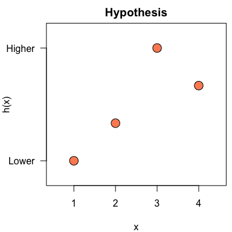
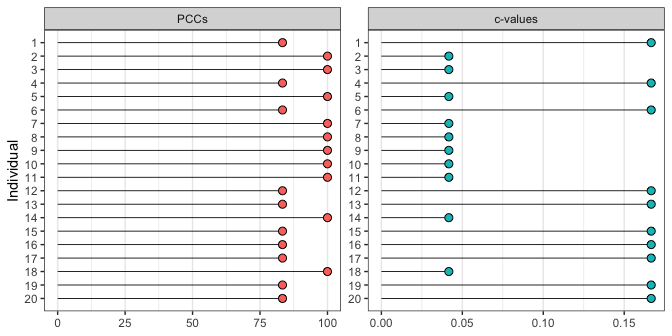
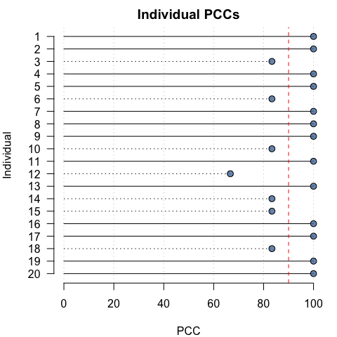
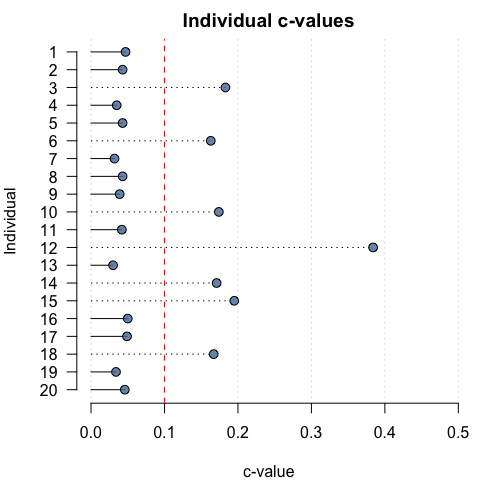
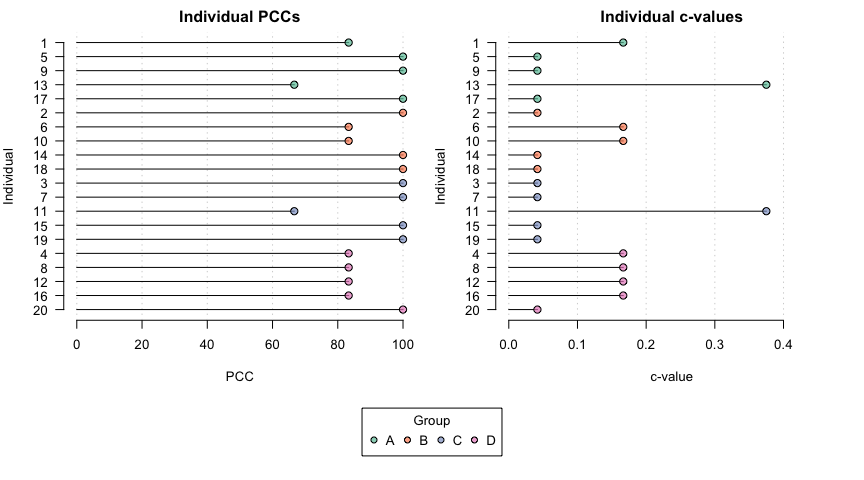

<!-- README.md is generated from README.Rmd. Please edit that file -->

# opa

<!-- badges: start -->


<!-- badges: end -->

An R package for ordinal pattern analysis.

## Installation

opa can be installed from CRAN with:

``` r
install.packages("opa")
```

You can install the development version of opa from
[GitHub](https://github.com/) with:

``` r
# install.packages("remotes")
remotes::install_github("timbeechey/opa")
```

## Citation

To cite opa in your work you can use the output of:

``` r
citation(package = "opa")
```

## Background

`opa` is an implementation of methods described in publications
including [Thorngate
(1987)](https://doi.org/10.1016/S0166-4115(08)60083-7) and [Grice et
al. (2015)](https://doi.org/10.1177/2158244015604192). Thorngate (1987)
attributes the original idea to:

Parsons, D. (1975). *The directory of tunes and musical themes*. S.
Brown.

## How ordinal pattern analysis works

Ordinal pattern analysis is similar to Kendall’s Tau. Whereas Kendall’s
tau is a measure of similarity between two data sets in terms of rank
ordering, ordinal pattern analysis is intended to quantify the match
between a hypothesis and patterns of individual-level data across
conditions or measurement instances.

Ordinal pattern analysis works by comparing the relative ordering of
pairs of observations and computing whether those pairwise relations are
matched by a hypothesis. Each pairwise ordered relation is classified as
an increases, a decrease, or as no change. These classifications are
encoded as 1, -1 and 0, respectively. For example, a hypothesis of a
monotonic increase in a response variable across four experimental
conditions can be specified as:

``` r
h <- c(1, 2, 3, 4)
```

Note that the absolute values are not important, only their relative
ordering. The hypothesis `h` encodes six pairwise relations, all
increases: `1 1 1 1 1 1`.

A row of individual data representing measurements across four
conditions, such as:

``` r
dat <- c(65.3, 68.8, 67.0, 73.1)
```

encodes six ordered pairwise relations `1 1 1 -1 1 1`. The percentage of
orderings which are correctly classified by the hypothesis (*PCC*) is
the main quantity of interest in ordinal pattern analysis. Comparing `h`
and `dat`, the PCC is `5/6 = 0.833` or 83.3%. A hypothesis which
generates a greater PCC is preferred over a hypothesis which generates a
lower PCC for given data.

It is also possible to calculate a *chance-value* for a PCC which is
equal to the chance that a PCC at least as great as the PCC of the
observed data could occur as a result of a random re-ordering of the
data. Chance values can be computed using either a permutation test or a
randomization test.

## Using `opa`

``` r
library(opa)
```

A hypothesized relative ordering of a response variable across
conditions is specified with a numeric vector:

``` r
h <- c(1, 2, 4, 3)
```

The hypothesis can be plotted with the `plot_hypothesis()` function:

``` r
plot_hypothesis(h)
```



Data should be in *wide* format with one column per measurement
condition and one row per individual:

``` r
set.seed(123)

dat <- data.frame(t1 = rnorm(20, mean = 12, sd = 2),
                  t2 = rnorm(20, mean = 15, sd = 2),
                  t3 = rnorm(20, mean = 20, sd = 2),
                  t4 = rnorm(20, mean = 17, sd = 2))
                  
round(dat, 2)
#>       t1    t2    t3    t4
#> 1  10.88 12.86 18.61 17.76
#> 2  11.54 14.56 19.58 16.00
#> 3  15.12 12.95 17.47 16.33
#> 4  12.14 13.54 24.34 14.96
#> 5  12.26 13.75 22.42 14.86
#> 6  15.43 11.63 17.75 17.61
#> 7  12.92 16.68 19.19 17.90
#> 8   9.47 15.31 19.07 17.11
#> 9  10.63 12.72 21.56 18.84
#> 10 11.11 17.51 19.83 21.10
#> 11 14.45 15.85 20.51 16.02
#> 12 12.72 14.41 19.94 12.38
#> 13 12.80 16.79 19.91 19.01
#> 14 12.22 16.76 22.74 15.58
#> 15 10.89 16.64 19.55 15.62
#> 16 15.57 16.38 23.03 19.05
#> 17 13.00 16.11 16.90 16.43
#> 18  8.07 14.88 21.17 14.56
#> 19 13.40 14.39 20.25 17.36
#> 20 11.05 14.24 20.43 16.72
```

An ordinal pattern analysis model to consider how the hypothesis `h`
matches each individual pattern of results in `dat` can be fitted using:

``` r
opamod <- opa(dat, h)
```

A summary of the model output can be viewed using:

``` r
summary(opamod)
#> Ordinal Pattern Analysis of 4 observations for 20 individuals in 1 group 
#> 
#> Between subjects results:
#>          PCC cval
#> pooled 93.33    0
#> 
#> Within subjects results:
#>       PCC cval
#> 1  100.00 0.05
#> 2  100.00 0.04
#> 3   83.33 0.18
#> 4  100.00 0.04
#> 5  100.00 0.04
#> 6   83.33 0.16
#> 7  100.00 0.03
#> 8  100.00 0.04
#> 9  100.00 0.04
#> 10  83.33 0.17
#> 11 100.00 0.04
#> 12  66.67 0.38
#> 13 100.00 0.03
#> 14  83.33 0.17
#> 15  83.33 0.20
#> 16 100.00 0.05
#> 17 100.00 0.05
#> 18  83.33 0.17
#> 19 100.00 0.03
#> 20 100.00 0.05
#> 
#> PCCs were calculated for pairwise ordinal relationships using a difference threshold of 0.
#> Chance-values were calculated using the method.
```

Individual-level model output can be plotted using:

``` r
plot(opamod)
```



To aid interpretation, individual PCCs and c-values can also be plotted
relative to user-specified thresholds:

``` r
pcc_plot(opamod, threshold = 90)
cval_plot(opamod, threshold = 0.1)
```



### Pairwise comparison of measurement conditions

Pairwise comparisons of measurement conditions can be calculated by
applying the `compare_conditions()` function to an `opafit` object
produced by a call to `opa()`:

``` r
condition_comparisons <- compare_conditions(opamod)

condition_comparisons$pccs
#>     1   2  3 4
#> 1   -   -  - -
#> 2  90   -  - -
#> 3 100 100  - -
#> 4  95  80 95 -
condition_comparisons$cvals
#>        1      2      3 4
#> 1      -      -      - -
#> 2  0.001      -      - -
#> 3 <0.001 <0.001      - -
#> 4 <0.001  0.005 <0.001 -
```

### Multiple groups

If the data consist of multiple groups a categorical grouping variable
can be passed with the `group` keyword to produce results for each group
within the data, in addition to individual results.

``` r
dat$group <- rep(c("A", "B", "C", "D"), 5)
dat$group <- factor(dat$group, levels = c("A", "B", "C", "D"))

opamod2 <- opa(dat[, 1:4], h, group = dat$group)
```

The summary output displays results organised by group.

``` r
summary(opamod2, digits = 3)
#> Ordinal Pattern Analysis of 4 observations for 20 individuals in 4 groups 
#> 
#> Between subjects results:
#>       PCC  cval
#> A 100.000 0.000
#> B  86.667 0.000
#> C  93.333 0.000
#> D  93.333 0.001
#> 
#> Within subjects results:
#>   Individual     PCC  cval
#> A          1 100.000 0.047
#> A          5 100.000 0.046
#> A          9 100.000 0.048
#> A         13 100.000 0.040
#> A         17 100.000 0.038
#> B          2 100.000 0.047
#> B          6  83.333 0.167
#> B         10  83.333 0.163
#> B         14  83.333 0.154
#> B         18  83.333 0.163
#> C          3  83.333 0.165
#> C          7 100.000 0.046
#> C         11 100.000 0.048
#> C         15  83.333 0.154
#> C         19 100.000 0.038
#> D          4 100.000 0.047
#> D          8 100.000 0.046
#> D         12  66.667 0.366
#> D         16 100.000 0.040
#> D         20 100.000 0.038
#> 
#> PCCs were calculated for pairwise ordinal relationships using a difference threshold of 0.
#> Chance-values were calculated using the method.
```

Similarly, plotting the output shows individual PCCs and c-values by
group.

``` r
plot(opamod2)
```



## Acknowledgements

Development of `opa` was supported by a [Medical Research
Foundation](https://www.medicalresearchfoundation.org.uk/) Fellowship
(MRF-049-0004-F-BEEC-C0899).
